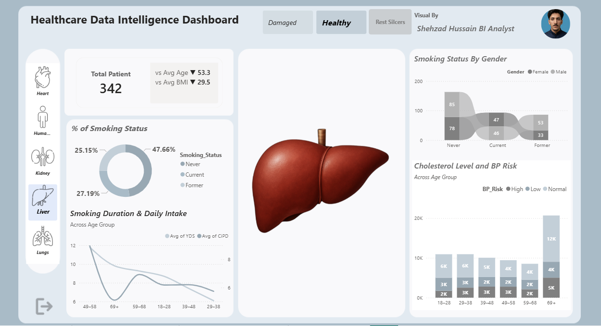
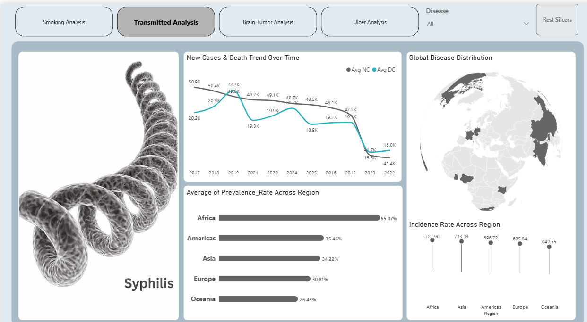
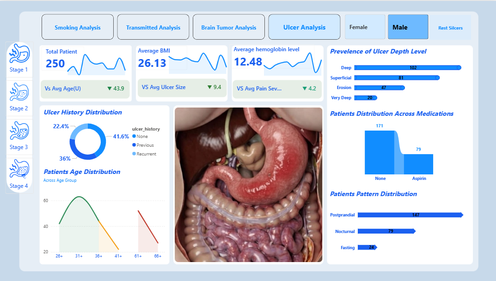
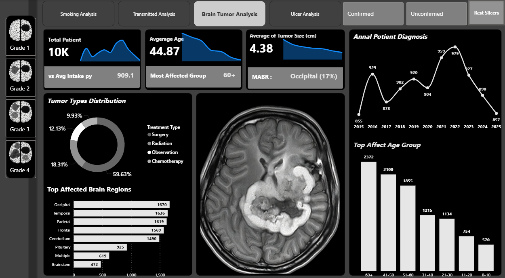

# Healthcare Data Intelligence Dashboard

An interactive, end-to-end Power BI dashboard designed to transform complex clinical and demographic patient data into actionable healthcare insights. This multi-page application evaluates patient risks, tracks disease trends globally, and visualizes specialized medical conditions using customized UI/UX design architectures.

## 📊 Dashboard Views & Core Features

The project is split into four distinct analytics modules, featuring custom light and dark themes optimized for clinical readability:

### 1. Smoking Analysis (Lifestyle Risk Factors)
* **Focus:** Tracks patient volume (342 total patients) against risk factors like average age (53.3) and BMI (29.5).
* **Key Visuals:** A demographic breakdown of smoking status by gender using a custom Sankey/Flow visual, a doughnut chart for smoking status distribution, and dual-line charts evaluating smoking duration against daily intake across age brackets.
* **Anatomical Integration:** Interactive organ navigation panel (Heart, Kidney, Liver, Lungs).

👉 **[View Full Resolution Dashboard View](smoking_analysis.png)**

### 2. Transmitted Analysis (Infectious Disease Tracking)
* **Focus:** Deep dive into global Syphilis trends, monitoring case rates and mortality metrics.
* **Key Visuals:** A dual-axis time-series line chart tracking New Cases vs. Death Trends, an interactive global choropleth map highlighting disease distribution, and localized bar/lollipop charts showing prevalence and incidence rates across geographic regions (Africa, Americas, Asia, Europe, Oceania).

👉 **[View Full Resolution Dashboard View](transmitted_analysis.png)**

### 3. Ulcer Analysis (Chronic Condition Management)
* **Focus:** Analyzes 250 patients dealing with varying stages of gastrointestinal ulcers.
* **Key Visuals:** KPI cards track average BMI (26.13) and hemoglobin levels (12.48). Features horizontal bar charts illustrating ulcer depth levels (Deep, Superficial, Erosion), patient age distribution curves, and correlation visuals detailing medication patterns (Aspirin vs. None) alongside symptom patterns (Postprandial, Nocturnal, Fasting).

👉 **[View Full Resolution Dashboard View](ulcer_analysis.png)**

### 4. Brain Tumor Analysis (Pathology Insights - Dark Theme)
* **Focus:** High-impact dark mode layout optimized for analyzing a large-scale cohort of 10K tumor cases.
* **Key Visuals:** Integrates cross-sectional MRI medical imaging with granular telemetry, including Average Tumor Size (4.38 cm) and the Most Affected Brain Region (Occipital at 17%). Tracks tumor type distributions (Surgery vs. Radiation vs. Chemotherapy) and patient diagnosis volumes over a multi-year trendline (2015–2025).

👉 **[View Full Resolution Dashboard View](brain_tumor_analysis.png)**

## 🛠️ Tech Stack & Skills Demonstrated
* **Business Intelligence:** Power BI Desktop
* **Data Modeling:** Star schema architecture with robust table relationships.
* **DAX (Data Analysis Expressions):** Engineered custom measures for running averages, regional prevalence rates, and dynamic KPI tracking.
* **UI/UX Design:** Implemented tab-based page navigation, custom icon integration, conditional formatting, and cohesive light/dark color palettes to enhance executive scannability.

---

## 📂 Project Structure & Repository Layout

* 📊 **[Healthcare_Data_Intelligence_Dashboard.pbix](Healthcare_Data_Intelligence_Dashboard.pbix)**: The core Power BI application file containing data models, DAX measures, and visual layouts.
* 📂 **Core Relational Datasets:**
  * 📄 [Health Dataset.csv](Health%20Dataset.csv)
  * 📄 [Ulcer Dataset.csv](Ulcer%20Dataset.csv)
  * 📄 [Organs.csv](Organs.csv)
  * 📄 [condition.csv](condition.csv)
* 🖼️ **Image Mapping Datasets (Clinical UI Triggers):**
  * 📄 [Image Dataset.csv](Image%20Dataset.csv)
  * 📄 [Health Image Dataset.csv](Health%20Image%20Dataset.csv)
  * 📄 [Tumor Images.csv](Tumor%20Images.csv)
  * 📄 [Ulcer Image Dataset.csv](Ulcer%20Image%20Dataset.csv)
* 📝 **[Measures and Columns Formula.txt](Measures%20and%20Columns%20Formula.txt)**: Documentation of key DAX equations used throughout the build.

## 💡 Key Clinical Insights Delivered
* **Demographic Vulnerabilities:** Identified specific age brackets (e.g., 69+) experiencing sharp spikes in high blood pressure and cholesterol risks, guiding preventative care targeting.
* **Geographic Priorities:** Visualized regional data showing Africa leading in prevalence rate (55.07%), isolating high-priority zones for medical resource allocation.
* **Treatment Pathways:** Discovered that over 59% of identified brain tumor cases utilize surgical intervention pathways, providing crucial operational volume forecasts for hospital resource planning.
